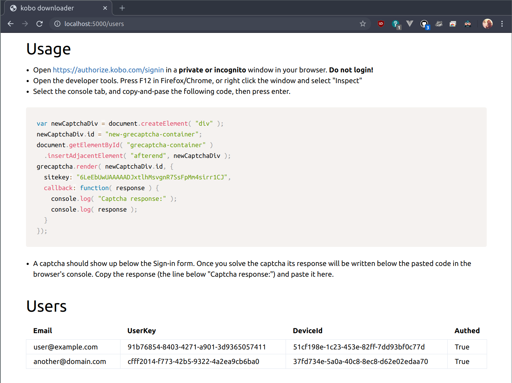
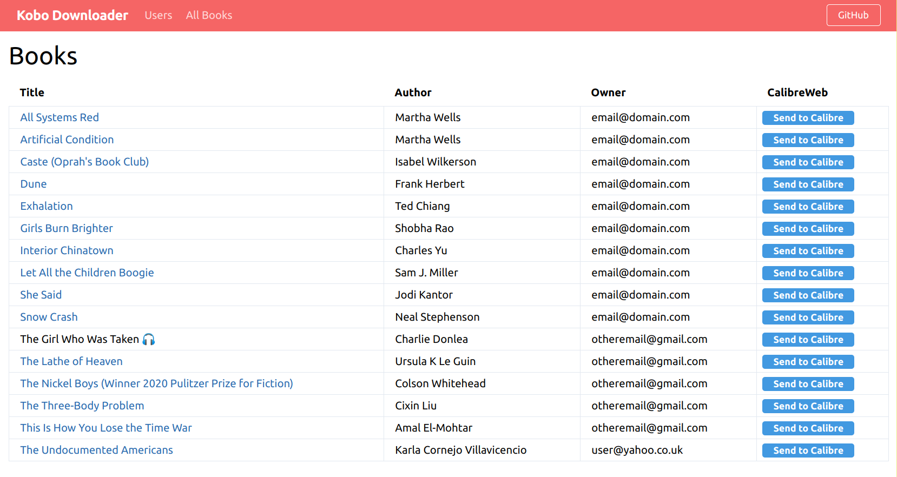
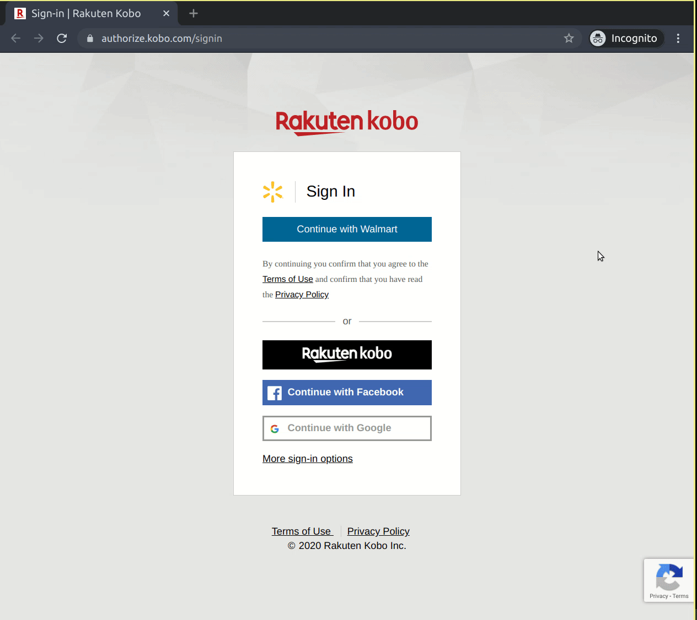

# kobodl

This is a hard fork of [kobo-book-downloader](https://github.com/TnS-hun/kobo-book-downloader), a command line tool to download and remove Digital Rights Management (DRM) protection from media legally purchased from [Rakuten Kobo](https://www.kobo.com/). The resulting [EPUB](https://en.wikipedia.org/wiki/EPUB) files can be read with, amongst others, [KOReader](https://github.com/koreader/koreader).

> **NOTE:** You must have a kobo email login for this tool to work (you can't use an external provider like Google or Facebook). However, you can create a NEW kobo account and link it with your existing account on the user profile page. Go to `My Account -> Account Settings` to link your new kobo login.

## Features

kobodl preserves the features from [TnS-hun/kobo-book-downloader](https://github.com/TnS-hun/kobo-book-downloader).

* stand-alone; no need to run other software or pre-download through an e-reader.
* downloads `.epub` formatted books

It adds several new features.

* **audiobook support**; command-line only for now.
  * Use `kobodl book get`. There will not be a download button in the webpage for audiobooks because they consist of many large files.
* **multi-user support**; fetch books for multiple accounts.
* **web interface**; adds new browser gui (with flask)
* **CalibreWeb Integration**; send books directly to CalibreWeb from the web interface.
* [docker image](https://github.com/subdavis/kobodl/pkgs/container/kobodl)
* [pypi package](https://pypi.org/project/kobodl/)

## Web UI

WebUI provides most of the same functions of the CLI. It was added to allow other members of a household to add their accounts to kobodl and access their books without having to set up python.

[See my **docker-compose** example](https://github.com/subdavis/selfhosted/blob/main/docker-compose.yml)

### User page



### Book list page



## Installation

with pipx

``` bash
pipx install kobodl
```

with pypi

``` bash
pip3 install kobodl
```

with docker

``` bash
# list users
docker run --rm -it --user $(id -u):$(id -g) \
  -v ${HOME}/.config:/home/config \
  ghcr.io/subdavis/kobodl \
  --config /home/config/kobodl.json user list

# run http server
docker run --rm -it --user $(id -u):$(id -g) \
  -p 5000:5000 \
  -v ${HOME}/.config:/home/config \
  -v ${PWD}:/home/downloads \
  ghcr.io/subdavis/kobodl \
  --config /home/config/kobodl.json \
  serve \
  --host 0.0.0.0 \
  --output-dir /home/downloads/kobodl_downloads
```

## Usage

General usage

``` bash
# Get started by adding one or more users
# See `Getting a reCAPTCHA code` below for more help
~$ kobodl user add

# List users
~$ kobodl user list

# Remove a user
~$ kobodl user rm email@domain.com

# List books
~$ kobodl book list

# List books for a single user
~$ kobodl book list --user email@domain.com

# List all books, including those marked as read
~$ kobodl book list --read

# Show book list help
~$ kobodl book list --help

# Download a single book with default options when only 1 user exists
# default output directory is `./kobo_downloads` 
~$ kobodl book get c1db3f5c-82da-4dda-9d81-fa718d5d1d16

# Download a single book with advanced options
~$ kobodl book get \
  --user email@domain.com \
  --output-dir /path/to/download_directory \
  c1db3f5c-82da-4dda-9d81-fa718d5d1d16

# Download ALL books with default options when only 1 user exists
~$ kobodl book get --get-all

# Download ALL books with advanced options
~$ kobodl book get \
  --user email@domain.com \
  --output-dir /path/to/download_directory \
  --get-all
```

Running the web UI

``` bash
~$ kobodl serve
 * Serving Flask app "kobodl.app" (lazy loading)
 * Environment: production
   WARNING: This is a development server. Do not use it in a production deployment.
   Use a production WSGI server instead.
 * Debug mode: off
 * Running on http://127.0.0.1:5000/ (Press CTRL+C to quit)
```

Global options

``` bash
# argument format
~$ kobodl [OPTIONS] COMMAND [ARGS]...

# set python tabulate formatting style.
~$ kobodl --fmt "pretty" COMMAND [ARGS]...

# set config path if different than ~/.config/kobodl.json
~$ kobodl --config /path/to/kobodl.json COMMAND [ARGS]...

# get version
~$ kobodl --version
```

## Getting a reCAPTCHA code

Adding a user requires a bit of hackery to get a reCAPTCHA code from Kobo's website. This GIF helps to explain how to do that.



## CalibreWeb Integration: **Experimental**

Kobodl's web interface can send books directly to your calibre web server.  Only supported from web client.

You must add your CalibreWeb server and user details directly in kobodl.json.  Make sure to include `/upload` in the url.  If you don't have CalibreWeb authentication on, leave these fields blank (`""`).

``` json
{
    "users": [ /* ... */ ],
    "calibre_web": {
        "enabled": true,
        "url": "https://calibre.domain.com/upload",
        "username": "CHANGEME",
        "password": "CHANGEME"
    }
}
```

> **NOTE**: you may need to add escape characters if your password contains a `\`, `"`, or others that require JSON escaping.

## Troubleshooting

> Some of my books are missing!

Try `kobodl book list --read` to show all "finished" and "archived" books.  You can manage your book status on [the library page](https://kobo.com/library).  Try changing the status using the "..." button.

> I see a mesage about "skipping _____" when I download all.

Try to download the book individually using `kobodl book get <revision-id>`, replacing `revision-id` with the UUID from the list table.

> I can't log in.  I get a message saying "The page format might have changed"

This happens from time to time, maybe once or twice a year.  Kobo changes their login page and makes it hard for the tool to parse out the necessary information.  Please open an issue.

## Development

To get set up for development:

1. clone this repo
1. create a virtual environment named `kobodl` with pyenv (optional)
1. `kobodl` should be available inside the virtual env

## Linting

VS Code is configured to do this for you. Otherwise, run the following:

``` bash
pip3 install -r dev-requirements.txt
isort -rc kobodl/*
black .
```

## Notes

kobo-book-downloader will prompt for your [Kobo](https://www.kobo.com/) e-mail address and password. Once it has successfully logged in, it won't ask for them again. Your password will not be stored on disk; Kobodl uses access tokens after the initial login.

Credit recursively to [kobo-book-downloader](https://github.com/TnS-hun/kobo-book-downloader) and the projects that lead to it.

## FAQ

**How does this work?**

kobodl works by pretending to be an Android Kobo e-reader.  It initializes a device, fetches your library, and downloads books as a "fake" Android app.

**Why does this download KEPUB formatted books?**

Kobo has different formats that it serves to different platforms.  For example, Desktop users generally get `EPUB3` books with `AdobeDrm` DRM.  Android users typically get `KEPUB` books with `KDRM` DRM, which is fairly easy to remove, so that's what you get when you use this tool.

**Is this tool safe and okay to use?**

I'm not a lawyer, and the discussion below is strictly academic.

The author(s) of `kobodl` don't collect any information about you or your account aside from what is made available through metrics from GitHub, PyPi, Docker Hub, etc.  See `LICENSE.md` for further info.

Kobo would probably claim that this tool violates its [Terms of Use](https://authorize.kobo.com/terms/termsofuse) but I'm not able to conclusively determine that it does so.  Some relevant sections are reproduced here.

> The download of, and access to any Digital Content is available only to Customers and is intended only for such Customers’ personal and non-commercial use. Any other use of Digital Content downloaded or accessed from the Service is strictly prohibited

This tool should only be used to download books for personal use.

> You may not obscure or misrepresent your geographical location, forge headers, use proxies, use IP spoofing or otherwise manipulate identifiers in order to disguise the origin of any message or transmittal you send on or through the Service. You may not pretend that you are, or that you represent, someone else, or impersonate any other individual or entity.

This might be a violation.  This client announces itself to Kobo servers as an Android device, which can safely be construed as "manipulating identifiers", but whether or not the purpose is to "disguise the origin" is unclear.

> Kobo may also take steps to prevent fraud, such as restricting the number of titles that may be accessed at one time, and monitoring Customer accounts for any activity that may violate these Terms. If Kobo discovers any type of fraud, Kobo reserves the right to take enforcement action including the termination or suspension of a User’s account.

In other words, you could have your account suspended for using `kobodl`. **Please open an issue on the issue tracker if this happens to you.**
